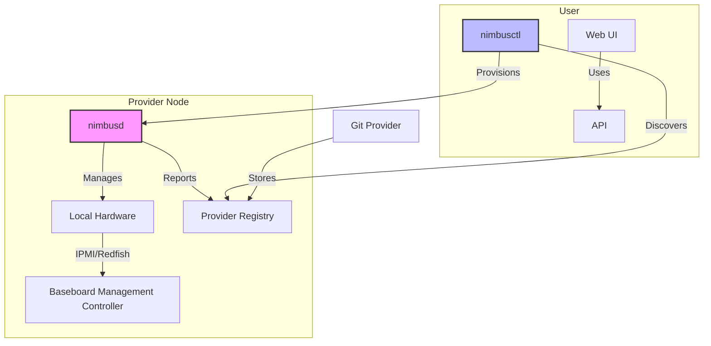
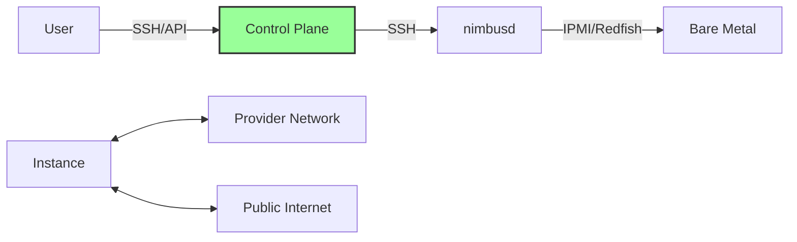

# Nimbus Architecture

## High-Level Overview

Nimbus is designed as a decentralized, peer-optional system for managing bare metal infrastructure. The architecture is built around several key components that work together while maintaining minimal dependencies on central coordination.

## Core Components

### 1. nimbusd (Agent)

The `nimbusd` daemon runs on each provider's hardware and is responsible for:

- **Hardware Discovery**: Automatically detects and inventories system resources
- **Resource Management**: Tracks available capacity and current allocations
- **Provisioning**: Handles OS installation and configuration
- **Monitoring**: Reports health metrics and status
- **Security**: Enforces access controls and isolation

### 2. nimbusctl (CLI)

The command-line interface for users and administrators to:

- Discover available providers and resources
- Provision and manage instances
- Monitor system status
- Configure local settings

### 3. Provider Registry

A Git repository containing TOML files describing available hardware. This serves as the source of truth for the system's state.

### 4. Web UI (Optional)

A modern web interface that provides a GCP-like experience for managing resources.

## Data Flow

1. **Provider Registration**:
   - Provider creates a TOML file describing their hardware
   - File is submitted via PR to the provider registry
   - After approval, the hardware becomes available for provisioning

2. **Instance Provisioning**:
   - User requests a new instance via `nimbusctl` or Web UI
   - System selects appropriate provider based on requirements
   - `nimbusd` on the target machine handles OS installation and configuration
   - User receives connection details

3. **Ongoing Management**:
   - `nimbusd` continuously reports metrics and status
   - Users can manage instances through the CLI or Web UI
   - Providers can update their hardware status via Git PRs

## Security Model

- **Authentication**: SSH keys for all machine access
- **Authorization**: Role-based access control (RBAC)
- **Isolation**: Network and resource isolation between tenants
- **Audit**: Comprehensive logging of all operations

## Networking

## Storage Architecture

- **Local Storage**: Direct-attached storage managed by `nimbusd`
- **Network Storage**: Optional iSCSI/NFS support for shared storage
- **Backup**: Snapshot and backup capabilities

## High Availability

- **Stateless Design**: Minimal state stored in the control plane
- **Self-Healing**: Automatic recovery from failures
- **Multi-Provider**: Workloads can span multiple providers for redundancy

## Scaling

- **Horizontal Scaling**: Add more provider nodes to increase capacity
- **Federation**: Multiple independent Nimbus installations can be federated
- **Caching**: Local caching of provider data for performance

## Monitoring and Observability

- Built-in metrics collection
- Integration with Prometheus and Grafana
- Centralized logging with log aggregation
